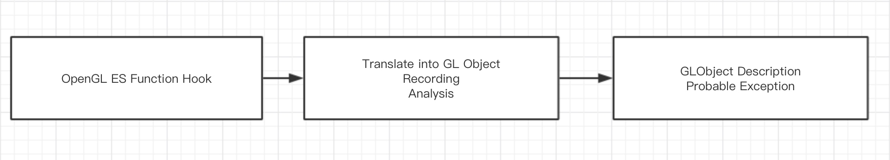
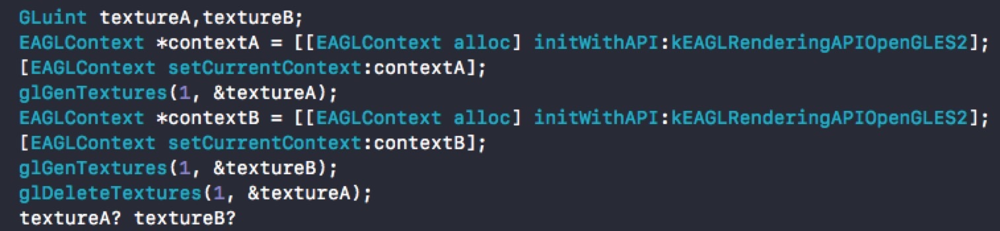
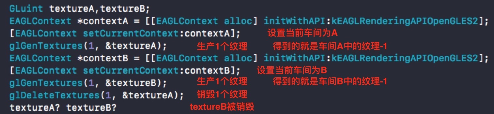
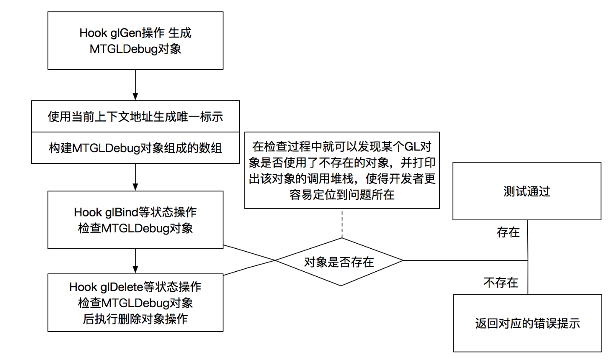
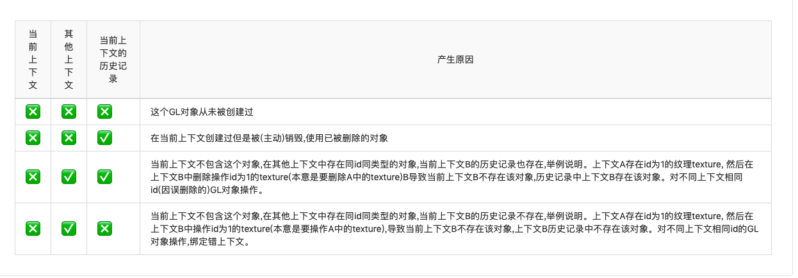

# MTGLDebug

## 简介

<!--简介-->
MTGLDebug 是作为OpenGL ES的辅助工具，可以在OpenGL ES开发过程中进行问题定位、性能调优及一些错误使用上进行纠正。

### 功能结构

<!--功能结构 - 图片-->

- 使用 `fishHook` Hook OpenGL ES相关函数
- OpenGL ES状态对象化
  记录当前GL对象
  逻辑分析(Optional)
- 返回所有GL对象信息
   返回逻辑分析结果(错误类型Optional)

## 为什么要做 MTGLDebug

- OpenGLES上下文相关的问题难以排查
- 在多线程中不好控制上下文的状态导致GL对象操作出错
- 简单理解OpenGLES上下文
  - OpenGLES上下文包含了所有OpenGLES状态的对象。
  - 一个上下文类似于一个车间，每个车间都有自己的资源，资源对应的生产、操作、销毁都要在车间内。
  - 同一时刻同一个线程只能有一个上下文存在。
- 简要理解GL状态机
  - GL中的大多数函数使用了一种基于状态的方法，大多数OpenGL对象都需要在使用前把该对象绑定到上下文上。
  - 让我们来看一个具体的例子
    
  - 那么问题来了，是textureA被删除还是textureB被删除？
    
  - GL接口是跨平台通用接口，所以在接口设计上会比较简单，来达到通用。这也导致使用句柄操作容易在不同上下文出现误操作。 例如上述的gldelete删除操作只能删除当前上下文对应id的gl对象，而不能指定删除某个上下文的某个gl对象。
  - 像textureA这个id就是抽象出来的gl对象，我们可以把它理解成一个状态的集合，它负责管理它下属的所有状态（宽高之类的）。	

## 为什么选择Hook

- 综上所述，GL的就是一个“状态机”。那些各种各样的API调用会改变这些状态，或者根据这些状态进行操作。 
- gl不是对象不能debug 所以思路是转换成对象 那要构造对象的生命周期 就需要对GL对象各个操作函数前后进行记录操作。所以得进行hook把gl转换成OC的对象来判断处理
- hook MTGLDebug的工作原理

<!--
- CV对象Hook【添加、检查、删除】
  - CVOpenGLESTextureRef   =>CVImageBufferRef 
  - A texture-based image buffer that supplies source image data to OpenGL ES.
  - CVOpenGLESTextureCache 缓存、管理的。
  - CVPixelBufferRef -> 创建 CVOpenGLESTextureRef

- 用Pixelbuffer的format判断，不检查420f 即从系统接口出来的samplebuffer

 支持shareGroup的GL资源创建检查
 -->

<!--Android相关
安卓调用堆栈记录 
   
-->

<!--Demo-->

## 崩溃归类

<!--1、 获取上下文资源不应在Debug线程【是否开启Exception，单元测试使用】

   - GLDebug内部逻辑问题

2、-->
 开启逻辑检测【是否仅内存检测】

- 有hook的GL函数调用
  - 4种逻辑错误抛出异常
    

    - 检测上下文是否存在 - "currentContextIsNotExist"
    - 在hook调用函数前后调用glGetError()

<!-- -"unknow" 表示该方法没有hook获取到对应错误数据-->
<!--未解决问题：某些效果错误较难排查，没有使用glFinish绘制未及时同步获取数据导致。-->

<!--   
##### 关闭MTGLDebugOptionsOnlyStatisticalGLObject执行
  - MTGLDebugOptionCheckContextStates【上下文资源逻辑检测】
    一般是图像会出错
  
  - MTGLDebugOptionCheckAPIUsageStates【glAPI检测】
    一般是崩溃在某个gl函数    

 - 创建DebugObject对象
    - addObject逻辑 
      -  取当前的上下文检测是否存在
      -  以sharegroup地址为key值，共享的GL资源为value
        【创建sharegroups字典】
      -  一个记录当前，一个记录历史
      -  如果sharegroup不在sharegroups中则以地址为key值加入sharegroup为value加入到sharegroups
      - 根据gl对象的target和object组合的字符串作为key值在加载入sharegroup共享资源字典里
     
    - CheckObject逻辑 
    
        -  

        
    - DeleteObject逻辑

       - 删除当前，历史记录不删    
-->

## 解决常见出现的问题

### iOS OpenGL ES 常见问题排查指北

对于 处理OpenGL ES 问题一脸懵逼的时候，这里准备了问题排查的 SOP

我们可以把OpenGLES在使用中经常出现的问题分为如下几类:

- 应用故障：应用执行结果与预期不一致。
- 对象故障：无法正确创建、删除、更新对象等。
- 内存泄露：无法验证是否彻底释放*OpenGL ES*资源。

### 排查工具

#### Xcode - GPU Frame Capture

大部分问题都可以通过Xcode自带的GPU Frame Capture 功能发现并解决，这个功能打开路径为:
`Edit Scheme` -> `Options` -> `GPU Frame Capture`

这里有两点需要注意的：

- **只支持真机调试**
- **单次调试需要把结果展示到屏幕上才算一次渲染，否则这个功能会卡在捕获GPU帧的过程中！！！**

### iOS组件 - MTGLDebug

少部分情况下我们会基于性能及代码独立性考虑使用多个上下文，但是可能因为*多线程冲突、逻辑缺陷*导致了操作了不属于自己的上下文。**MTGLDebug**就是设计来解决这个问题。
